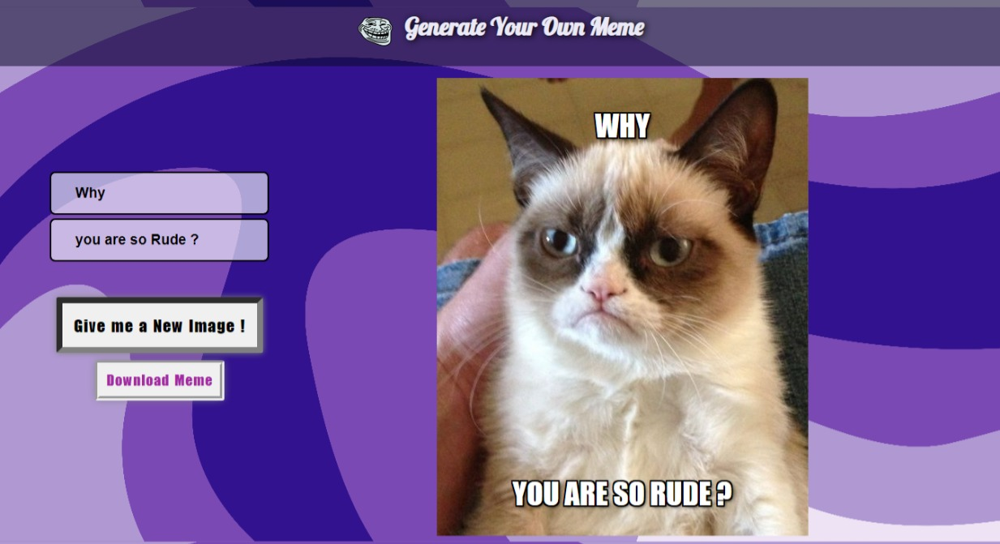

# Meme Generator App

## Overview

### What this app do ?

It is a Meme generator app. You can generate you own Meme by this web app. You can 
change text and generate different images according to your preferances.

## Screenshot


<br/><br/>



### Links

- Live Site URL: [Meme Generator App](https://meme-generator-io.netlify.app/)

## My process

### Built with

- HTML5
- CSS custom properties
- Flexbox
- [React](https://reactjs.org/) - JS library
- Canvas

### What I learned
 
- I have learnt how to use the API to generate random images.
- I have learnt some basics about Canvas.
- I have learnt how to make download functionality for a ReactJS elements using html2canvas


```ReactJS
const canvas = html2canvas(
        capturedData,
        {allowTaint: true, useCORS: true, logging: true}
        );

    const imgUrl = canvas.toDataURL("image/png", 1.0 );
```

### Useful resources

- [html2canvas](https://html2canvas.hertzen.com/) - This helped me for making download functionality. I really liked it's working and will use it going forward.

## Author

- Website - [Sagar Sharma]()
